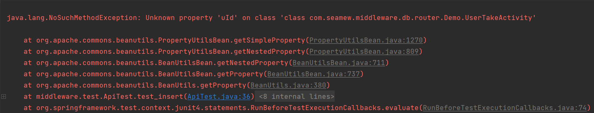

## 问题复现

在使用第三方工具类BeanUtils的getProperty方法时候遇见的奇怪的BUG。

* 实体类UserTakeActivity

```java
@Data
public class UserTakeActivity {
    /**
     * 自增ID
     */
    private Long id;
    /**
     * 用户ID
     */
    private String uId;
}
```

* 测试方法报错

```java
@Test
public void test_insert() throws Exception {
    UserTakeActivity userTakeActivity = new UserTakeActivity();
    userTakeActivity.setUId("Uhdgkw766120d"); // 1库：Ukdli109op89oi 2库：Ukdli109op811d
    System.out.println(BeanUtils.getProperty(userTakeActivity, "uId"));
}
```



* 换成UId就不报错

```java
@Test
public void test_insert() throws Exception {
    UserTakeActivity userTakeActivity = new UserTakeActivity();
    userTakeActivity.setUId("Uhdgkw766120d"); // 1库：Ukdli109op89oi 2库：Ukdli109op811d
    System.out.println(BeanUtils.getProperty(userTakeActivity, "UId"));
}
```


## 问题原因

查看`BeanUtils`的源码

```java
private BeanIntrospectionData getIntrospectionData(final Class<?> beanClass) {
    if (beanClass == null) {
        throw new IllegalArgumentException("No bean class specified");
    }

    // Look up any cached information for this bean class
    // 获取data元信息
    BeanIntrospectionData data = descriptorsCache.get(beanClass);
    if (data == null) {
        data = fetchIntrospectionData(beanClass);
        descriptorsCache.put(beanClass, data);
    }

    return data;
}
```

该方法导致获取name为UId，与实际的不一致
```java
public static String decapitalize(String name) {
    if (name == null || name.length() == 0) {
        return name;
    }
    if (name.length() > 1 && Character.isUpperCase(name.charAt(1)) &&
        Character.isUpperCase(name.charAt(0))){
        return name;
    }
    char chars[] = name.toCharArray();
    chars[0] = Character.toLowerCase(chars[0]);
    return new String(chars);
}
```

BeanUtils.getProperty遵循Java Beans规范的java.beans.Introspectors行为。

以后对变量进行命名不要第一个和第二个字母都是大写。会导致歧义

## 参考链接

[BEANUTILS-369](https://issues.apache.org/jira/browse/BEANUTILS-369)
