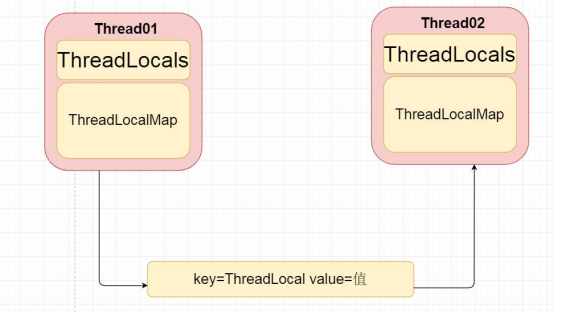

## 谈谈你对 Threadlocal 理解？

ThreadLocal提供了线程本地变量，它可以保证访问到的变量属于当前线程，每个线程都保存有一个变量副本，每个线程的变量都不同。ThreadLocal相当于提供了一种线程隔离，将变量与线程相绑定。

* 适用于在多线程的情况下，可以实现传递数据，实现线程隔离。
* ThreadLocal提供给我们每个线程缓存局部变量。

## Threadlocal 基本 API

1. New Threadlocal();---创建 Threadlocal
2. set 设置当前线程绑定的局部变量
3. get 获取当前线程绑定的局部变量
4. remove() 移除当前线程绑定的变量

## 哪些地方有使用 Threadlocal

1. Spring 事务模板类
2. 获取 HttpRequest
3. Aop 调用链、LCN 分布式事务、分布式服务追踪框架源码

## Threadlocal与Synchronized

Threadlocal与Synchronized都可以实现多线程访问，保证线程安全问题。
1. Synchronized采用当多个线程竞争到同一个资源的时候，最终只能有一个线程访问，采用时间换空间的方式，保证线程安全问题
2. Threadlocal在每个线程中都有自己独立的局部变量，空间换时间，互相之间都是隔离。相比来说Threadlocal效率比Synchronized更高。

## Threadlocal 底层实现原理

1. 在每个线程中都有自己独立的 ThreadLocalMap 对象，中 Entry 对象。
2. 如果当前线程对应的的 ThreadLocalMap 对象为空的情况下，则创建该 ThreadLocalMap对象，并且赋值键值对。
Key 为 当前 new ThreadLocal 对象，value 就是为 object 变量值。



```java
	// Threadlocal的set方法
    public void set(T value) {
        Thread t = Thread.currentThread();
        ThreadLocalMap map = getMap(t);
        if (map != null)
            map.set(this, value);
        else
            createMap(t, value);
    }
    // 线程都有独立的ThreadLocalMap对象
    public T get() {
        Thread t = Thread.currentThread();
        ThreadLocalMap map = getMap(t);
        if (map != null) {
            ThreadLocalMap.Entry e = map.getEntry(this);
            if (e != null) {
                @SuppressWarnings("unchecked")
                T result = (T)e.value;
                return result;
            }
        }
        return setInitialValue();
    }
    // ThreadLocalMap生命周期就是线程的周期
```

## 为什么线程缓存的是 ThreadlocalMap 对象

ThreadLocalMap 可以存放 n 多个不同的 ThreadLocal 对象；

每个 ThreadLocal 对象只能缓存一个变量值；

ThreadLocalMap<ThreadLocal 对象,value> threadLocalMap

ThreadLocal.get();

threadLocalMap.get(ThreadLocal)-----缓存变量值

## 谈谈强、软、弱、虚引用 区别

1. 强引用： 当内存不足时，JVM 开始进行 GC(垃圾回收)，对于强引用对象，就算是出现了OOM 也不会对该对象进行回收，死都不会收。
2. 软引用：当系统内存充足的时候，不会被回收；当系统内存不足时，它会被回收，软引用通常用在对内存敏感的程序中，比如高速缓存就用到软引用，内存够用时就保留，不够时就回收。
3. 弱引用：弱引用需要用到 java.lang.ref.WeakReference 类来实现，它比软引用的生存周期更短。对于只有弱引用的对象来说，只要有垃圾回收，不管 JVM 的内存空间够不够用，都会回收该对象占用的内存空间。
4. 虚引用：虚引用需要 java.lang.ref.Phantomreference 类来实现。顾名思义，虚引用就是形同虚设。与其它几种引用不同，虚引用并不会决定对象的生命周期。

## Threadlocal 为何引发内存泄漏问题

::: tip 补充概念：
内存泄漏问题：表示就是我们程序员申请了内存，但是该内存一直无法释放；

内存泄漏溢出问题：申请内存时，发现申请内存不足，就会报错内存溢出的问题；
:::

因为每个线程中都有自己独立的 ThreadLocalMap 对象，key 为 ThreadLocal，value 是为变量值。Key 为 ThreadLocal 作为 Entry 对象的 key，threadlocal里面的Entry extends WeakReference（弱引用，所以说key为弱引用，当 ThreadLocal 指向 null 的时候，Entry 对象中的 key 变为 null，GC 如果没有清理垃圾时，则该对象会一直无法被垃圾收集机制回收，一直占用到了系统内存，有可能会发生内存泄漏的问题。

## 如何防御 Threadlocal 内存泄漏问题

1. 可以自己调用 remove 方法将不要的数据移除避免内存泄漏的问题；
2. 每次在做 set 方法的时候会清除之前 key 为 null；
```java
for (Entry e = tab[i];
     e != null;
     e = tab[i = nextIndex(i, len)]) {
    ThreadLocal<?> k = e.get();

    if (k == key) {
        e.value = value;
        return;
    }

    if (k == null) {
        replaceStaleEntry(key, value, i);
        return;
    }
}
```
3. Threadlocal 为弱引用；

## Threadlocal 采用弱引用而不是强引用

1. 如果 key 是为强引用： 当我们现在将 ThreadLocal 的引用指向为 null，但是每个线程中有自己独立 ThreadLocalMap 还一直在继续持有该对象，所以我们ThreadLocal 对象不会被回收，就会发生 ThreadLocal 内存泄漏的问题。
2. 如果 key 是为弱引用：当我们现在将 ThreadLocal 的引用指向为 null，Entry 中的 key 指向为 null，但是下次调用 set 方法的时候，会根据判断如果 key 空的情况下，直接删除，避免了 Entry 发生内存泄漏的问题。
3. 不管是用强引用还是弱引用都是会发生内存泄漏的问题。弱引用中不会发生 ThreadLocal 内存泄漏的问题。
4. 但是最终根本的原因 Threadlocal 内存泄漏的问题，产生于 ThreadLocalMap 与我们当前线程的生命周期一样，如果没有手动的删除的情况下，就有可能会发生内存泄漏的问题。
