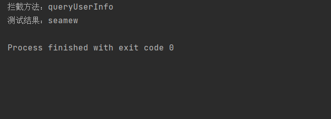

## 1、AOP自动代理类--DefaultAdvisorAutoProxyCreator

该类主要作用是`postProcessBeforeInstantiation`方法，该方法将符合要求的类创建为代理对象。
```java
@Override
public Object postProcessBeforeInstantiation(Class<?> beanClass, String beanName) {
  // 省略大部分代码
  TargetSource targetSource = getCustomTargetSource(beanClass, beanName);
  if (targetSource != null) {
    if (StringUtils.hasLength(beanName)) {
      this.targetSourcedBeans.add(beanName);
    }
    Object[] specificInterceptors = getAdvicesAndAdvisorsForBean(beanClass, beanName, targetSource);
    // 通过ProxyFactory工厂创建代理对象
    Object proxy = createProxy(beanClass, beanName, specificInterceptors, targetSource);
    this.proxyTypes.put(cacheKey, proxy.getClass());
    return proxy;
  }

  return null;
}
```

ProxyFactory是JdkDynamicAopProxy工厂和ObjenesisCglibAopProxy工厂的策略类，`createAopProxy`方法会根据输入的config来选择方式创建代理对象
```java
@Override
public AopProxy createAopProxy(AdvisedSupport config) throws AopConfigException {
  if (config.isOptimize() || config.isProxyTargetClass() || hasNoUserSuppliedProxyInterfaces(config)) {
    Class<?> targetClass = config.getTargetClass();
    if (targetClass == null) {
      throw new AopConfigException("TargetSource cannot determine target class: " +
          "Either an interface or a target is required for proxy creation.");
    }
    if (targetClass.isInterface() || Proxy.isProxyClass(targetClass)) {
      return new JdkDynamicAopProxy(config);
    }
    return new ObjenesisCglibAopProxy(config);
  }
  else {
    return new JdkDynamicAopProxy(config);
  }
}
```

## 2、创建Advice

一个advice就是一个方法，即目标对象必须要执行的完成的工作。

因为spring aop只能代理目标方法，所有advice就会被解析成`MethodAdvice`。

这里以`BeforeAdvice`举例。


这里我们创建一个类实现`MethodBeforeAdvice`接口即可。

```java
public class UserServiceBeforeAdvice implements MethodBeforeAdvice {

    @Override
    public void before(Method method, Object[] args, Object target) throws Throwable {
        System.out.println("拦截方法：" + method.getName());
    }

}
```

## 3、创建Interceptor

第二节我们创建了`MethodBeforeAdvice`，但只有这个类还不够，因为我们的方法还无法继续往下执行，需要将`MethodBeforeAdvice`转化为`methodInterceptor`。它封装了`MethodBeforeAdvice`，将其变成真正的**增强方法**，因为`methodInterceptor`封装了代理方法，提供了统一的逻辑。

```xml
<bean id="methodInterceptor" class="com.seamew.springframework.aop.framework.adapter.MethodBeforeAdviceInterceptor">
    <property name="advice" ref="beforeAdvice"/>
</bean>
```

## 4、创建Advisor

一个advisor对应一个pointcut和一个advice。

```xml
<bean id="pointcutAdvisor" class="com.seamew.springframework.aop.aspectj.AspectJExpressionPointcutAdvisor">
    <property name="expression" value="execution(* bean.IUserService.*(..))"/>
    <property name="advice" ref="methodInterceptor"/>
</bean>
```

`pointcut`即为切面，它提供了方法和类的过滤。

```java
public class AspectJExpressionPointcut implements Pointcut, ClassFilter, MethodMatcher {
    public static final Set<PointcutPrimitive> SUPPORTED_PRIMITIVES = new HashSet<>();

    static {
        SUPPORTED_PRIMITIVES.add(PointcutPrimitive.EXECUTION);
    }

    private final PointcutExpression pointcutExpression;

    public AspectJExpressionPointcut(String expression) {
        PointcutParser pointcutParser = PointcutParser.getPointcutParserSupportingSpecifiedPrimitivesAndUsingSpecifiedClassLoaderForResolution(SUPPORTED_PRIMITIVES, this.getClass().getClassLoader());
        pointcutExpression = pointcutParser.parsePointcutExpression(expression);
    }

    @Override
    public boolean matches(Class<?> clazz) {
        return pointcutExpression.couldMatchJoinPointsInType(clazz);
    }

    @Override
    public boolean matches(Method method, Class<?> targetClass) {
        // alwaysMatches需要匹配所有的pointcut条件
        return pointcutExpression.matchesMethodExecution(method).alwaysMatches();
    }

    @Override
    public ClassFilter getClassFilter() {
        return this;
    }

    @Override
    public MethodMatcher getMethodMatcher() {
        return this;
    }
}

```

## 5、测试结果和问题探究


### 5.1、测试结果

```java
@Test
public void test_aop() {
    ClassPathXmlApplicationContext applicationContext = new ClassPathXmlApplicationContext("classpath:spring.xml");
    IUserService userService = applicationContext.getBean("userService", IUserService.class);
    System.out.println("测试结果：" + userService.queryUserInfo());
}
```

测试结果



### 5.2、问题

1. spring aop提供了BeforeAdvice，AfterAdvice。但是却没有AroundAdvice？

答：因为Advice在spring aop内部会转换为Interceptor，可以这样理解advice就是Interceptor。AroundAdvice接口可以由Interceptor接口实现，就不需要重复定义接口增加代码复杂度了，这里spring aop版本是**5.2.2**。后面spring aop是否会增加这样一个接口也不得而知。

2. spring在创建aop代理的时候，为什么不会执行`BeforeInitialization`方法？

```java
protected Object createBean(String beanName, BeanDefinition beanDefinition, Object[] args) throws BeansException {
    Object bean = null;
    try {
        // 判断是否返回代理 Bean 对象
        bean = resolveBeforeInstantiation(beanName, beanDefinition);
        if (null != bean) {
            return bean;
        }
    }
}

protected Object resolveBeforeInstantiation(String beanName, BeanDefinition beanDefinition) {
    Object bean = applyBeanPostProcessorBeforeInstantiation(beanDefinition.getBeanClass(), beanName);
    if (null != bean) {
        bean = applyBeanPostProcessorsAfterInitialization(bean, beanName);
    }
    return bean;
}
```
答：这里的`Instantiation`可以理解为实例化完成，或者叫做实例化+初始化完成。根据spring doc的描述

**This callback will also be invoked after a short-circuiting triggered by a InstantiationAwareBeanPostProcessor postProcessBeforeInstantiation method, in contrast to all other BeanPostProcessor callbacks.**

表明了它会短路执行到这个方法，然后直接返回bean对象。