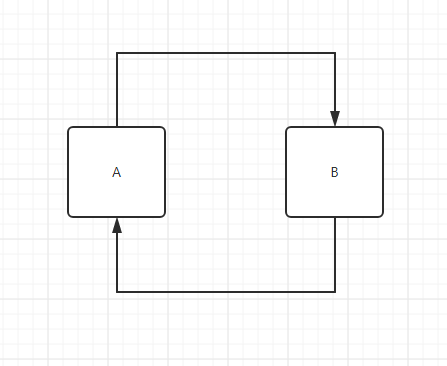
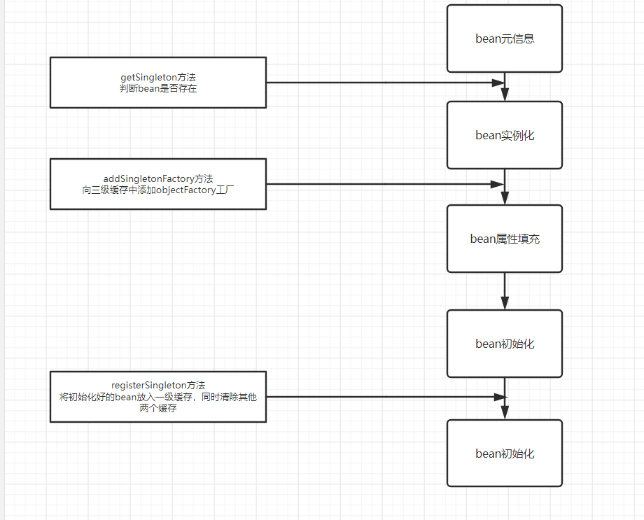
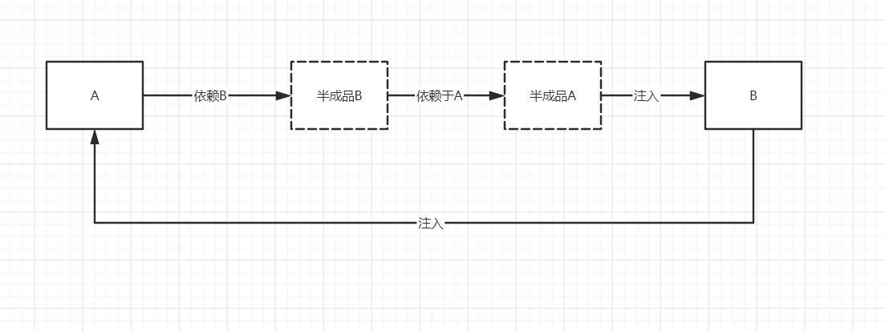

## 一、什么是三级缓存

就是在Bean生成流程中保存Bean对象三种形态的三个Map集合，如下：

```java
// 一级缓存Map 存放完整的Bean（流程跑完的）
private final Map<String, Object> singletonObjects = new ConcurrentHashMap(256);

// 二级缓存Map 存放不完整的Bean（只实例化完，还没属性赋值、初始化）
private final Map<String, Object> earlySingletonObjects = new ConcurrentHashMap(16);

// 三级缓存Map 存放一个Bean的lambda表达式（也是刚实例化完）
private final Map<String, ObjectFactory<?>> singletonFactories = new HashMap(16);
```

三级缓存主要用来解决循环依赖问题！

**什么是循环依赖?**

就像下面这样，A中注入了B，而B中又注入了A，这就是循环依赖。
```java
@Component
public class A {

    @Autowired
    private B b;
}

@Component
public class B {

    @Autowired
    private A a;
}
```



## 二、三级缓存详解

三级缓存在spring内部主要有三处地方使用。

1. Bean实例化前会先查询缓存，判断Bean是否已经存在
2. Bean属性赋值前会先向三级缓存中放入一个lambda表达式，该表达式执行则会生成一个半成品Bean放入二级缓存
3. Bean初始化完成后将完整的Bean放入一级缓存，同时清空二、三级缓存




### getSingleton

方法主要逻辑：
1. 从一级缓存获取，获取到了，则返回
2. 从二级缓存获取，获取到了，则返回
3. 从三级缓存获取，获取到了，则执行三级缓存中的lambda表达式，将结果放入二级缓存，清除三级缓存

```java
@Override
public Object getSingleton(String beanName) {
    Object singletonObject = singletonObjects.get(beanName);
    if (null == singletonObject) {
        singletonObject = earlySingletonObjects.get(beanName);
        // 判断二级缓存中是否有对象，这个对象就是代理对象，因为只有代理对象才会放到三级缓存中
        ObjectFactory<?> singletonFactory = singletonFactories.get(beanName);
        if (singletonFactory != null) {
            singletonObject = singletonFactory.getObject();
            // 把三级缓存中的代理对象中的真实对象获取出来，放入二级缓存中
            earlySingletonObjects.put(beanName, singletonObject);
            // 移除三级缓存的对象
            singletonFactories.remove(beanName);
        }
    }
    return singletonObject;
}
```

### addSingletonFactory

方法主要逻辑：
将一个lambda表达式放入了三级缓存，同时移除二级缓存的对象
```java
protected void addSingletonFactory(String beanName, ObjectFactory<?> singletonFactory){
    if (!this.singletonObjects.containsKey(beanName)) {
        this.singletonFactories.put(beanName, singletonFactory);
        this.earlySingletonObjects.remove(beanName);
    }
}
```

### registerSingleton

方法主要逻辑：
将初始化完成的bean放入一级缓存中，同时清除二三级缓存对象。
```java
public void registerSingleton(String beanName, Object singletonObject) {
    singletonObjects.put(beanName, singletonObject);
    earlySingletonObjects.remove(beanName);
    singletonFactories.remove(beanName);
}
```

### 总结

假设现在要创建A这个bean，缓存是如何变化？

1. 实例化前，获取缓存判断（三个缓存中肯定没有A，获取为null，进入实例化流程）
2. 实例化完成，属性注入前（往三级缓存中放入了一个lambda表达式，一、二级为null）
3. 初始化完成（将A这个Bean放入一级缓存，清除二、三级缓存）

## 三、怎么解决的循环依赖

以A注入B，B注入A为例：



A属性注入前就把lambda表达式放入了第三级缓存，所以B再注入A的时候会从第三级缓存中找到A的lambda表达式并执行，然后将半成品Bean放入第二级缓存，所以此时B注入的只是半成品的A对象，B创建完成后返回给A注入，A继续初始化，完成创建。

## 四、总结

1. 一级缓存：用于存储被完整创建了的bean。也就是完成了初始化之后，可以直接被其他对象使用的bean。
2. 二级缓存：用于存储半成品的Bean。也就是刚实例化但是还没有进行初始化的Bean
3. 三级缓存：三级缓存存储的是工厂对象（lambda表达式）。工厂对象可以产生Bean对象提前暴露的引用（半成品的Bean或者半成品的代理Bean对象），执行这个lambda表达式，就会将引用放入二级缓存中

**为什么使用lambda表达式形式存入三级缓存？** 

为了区分aop代理对象和普通bean对象。

**第二级缓存用来干嘛的？** 

存放半成品的引用，可能产生多对象循环依赖，第三级缓存产生引用后，后续的就可以直接注入该引用。
例如：假设A同时注入了B和C，B和C又都注入了A。