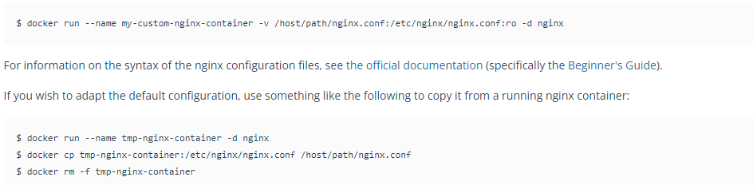
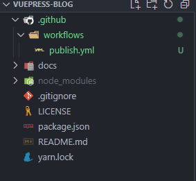
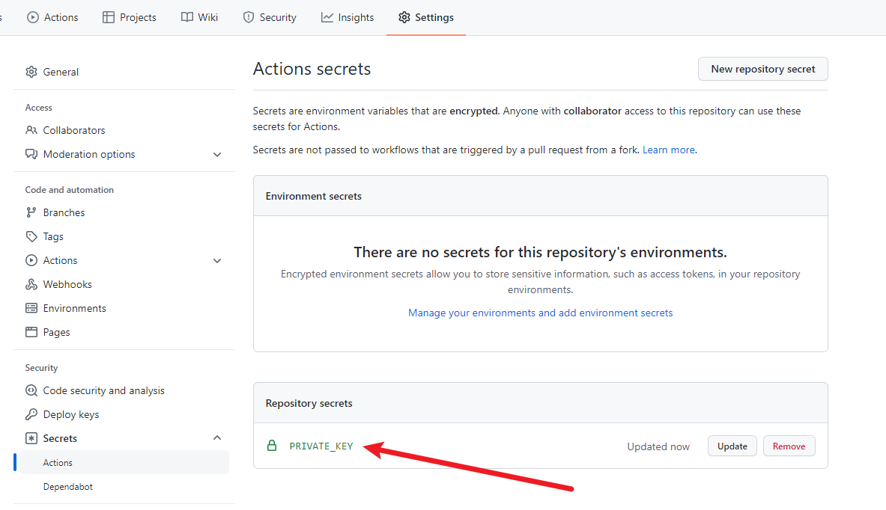
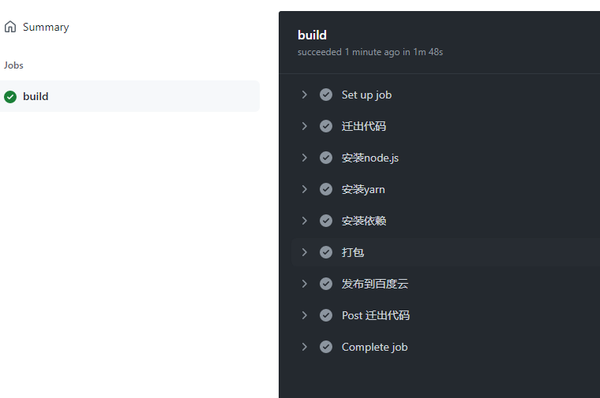
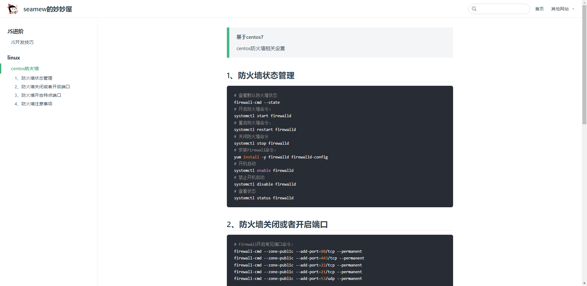

## 1、启动docker容器



1. 首先创建一个容器，导出默认的配置文件

```shell
docker run -d --name=test nginx

docker cp test:/etc/nginx ~/conf
```

2. 删除刚刚的容器，并且建立项目路径

```shell
docker rm -f test 

mv conf  ./front/blog/

mkdir front/blog/html
```

3. 启动容器挂载目录

```shell
docker run -d -p 80:80 --restart=on-failure:5 --name=blog -v /root/front/blog/html:/usr/share/nginx/html -v /root/front/blog/conf:/etc/nginx nginx
```

## 2、全自动部署

这里会涉及的配置有：

- 我们开发机需要配置连接服务器的免密登录
- 设置 github 仓库的私钥为本地开发机的私钥
- 项目根目录下创建`.github/workflows/publish.yml`
- 服务器配置 nginx 或者配置 docker

### 为什么要配置免密登录？

这里有个细节，这里的免密登录并不是代表我们在所有的电脑连接服务器都不需要输入密码，而是我们开发机连接服务器不需要输入密码，当我们连接的时候会自动的以我们开发机的 ssh 私钥作为密码进行匹配，如果匹配成功就会登录成功，因为这个过程是自动的，所以看起来跟不用输入密码一样，实际上是需要的。

### github 仓库私钥设置了干什么？

github 会以我们开发机的私钥作为密码去连接我们的服务器，服务器只看私钥，它发现私钥是正确的，就会给予通过，我们就能访问成功连接服务器，就可以传输文件了。

### 示例

项目结构



.github/workflows/publish.yml

```yml
name: 打包vuepress博客

on:
  push:
    # push 代码的时候 哪个分支会受到影响 这里是 main 主分支
    branches:
      - main

# 推送之后执行一系列的任务
jobs:
  build:
    # 运行 ubuntu虚拟机系统
    runs-on: ubuntu-latest
    steps:
      # 获取代码
      - name: 迁出代码
        # 使用action库
        uses: actions/checkout@master
      # 安装Node10

      - name: 安装node.js
        # 使用action库  actions/setup-node安装node
        uses: actions/setup-node@v1
        with:
          node-version: 14.18.0

      - name: 安装yarn
        run: npm install -g yarn

      # 安装依赖
      - name: 安装依赖
        run: yarn

      # 打包
      - name: 打包
        run: yarn docs:build

      # 上传到自己的服务器
      - name: 发布到百度云
        uses: easingthemes/ssh-deploy@v2.1.1
        env:
          # 私钥 PRIVATE_KEY 要和 仓库的私钥名一致 也就是私钥名也要叫 PRIVATE_KEY
          SSH_PRIVATE_KEY: ${{ secrets.PRIVATE_KEY }}
          # SCP参数
          ARGS: "-avzr --delete"
          # 源目录 -- 打包后的文件目录，也就是这个文件会被传到服务器上
          SOURCE: "docs/.vuepress/dist/*"
          # 服务器ip
          REMOTE_HOST: "你的IP"
          # 用户
          REMOTE_USER: "root"
          # 目标地址 -- 上传到服务器的地址
          TARGET: "/root/front/blog/html"

```

在仓库中设置私钥



配置好以上的操作就可以，当我们代码写好了之后执行`git push`就可以前往 github 仓库下的`Actions`栏目下看进度了，这是个图形化的优雅界面，非常的 NICE



之后就可以前往服务器中查看指定目录下是否含有我们打包后的文件了，如果前面的步骤都没有报错，那么是肯定会有的。

最后通过浏览器访问



## 总结

通过**github action**是CICD的一种实现方式。但如果是前端的一些小网站，还是优选**github action**。

