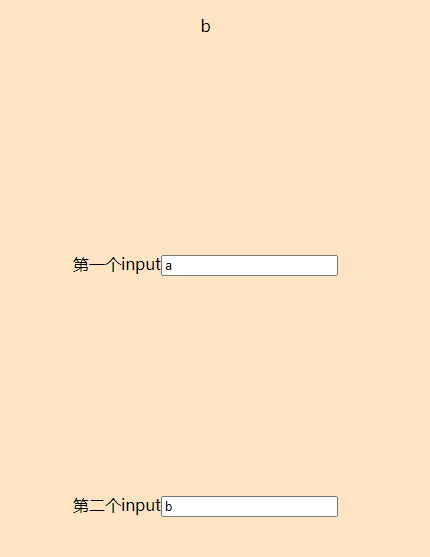
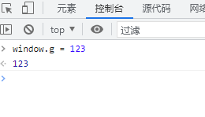
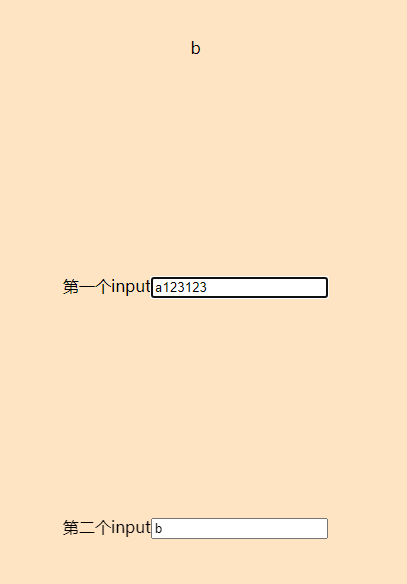
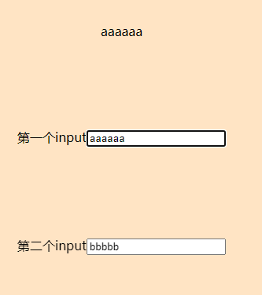
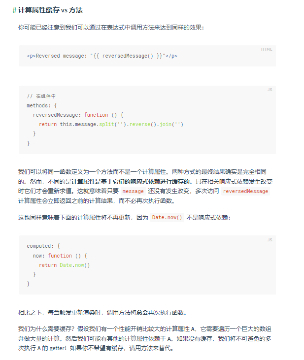
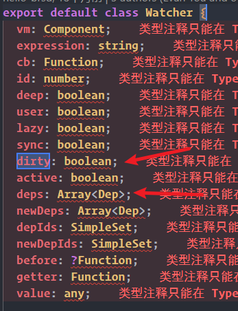

## 问题描述

* 现在有一个简单的vue demo样例，他的界面和代码如下：
```vue
<template>
  <div class="main">
    {{ test }}
    <div>第一个input<input type="text" v-model="valueA"></div>
    <div>第二个input<input type="text" v-model="valueB"></div>
  </div>
</template>

<script>
export default {
  name: "App",
  data() {
    return {
      valueA: 'a',
      valueB: 'b',
    };
  },
  computed: {
    test() {
      return window.g ? this.valueA : this.valueB;
    }
  },
};
</script>

<style scoped>
.main {
  height: 100vh;
  display: flex;
  flex-direction: column;
  align-items: center;
  justify-content: space-evenly;
}
</style>

```

***



* 先将**window.g**赋值，然后当我们改变第一个input框里面的数据时候，计算属性不会发生改变




* 当我们改变第二个input框里面的数据时候，再改变第一个input框，他的值才会发生变化。这是为什么？




## 问题原因

* 这是官网对于计算属性的描述



* 阅读源码发现dirty属性判断该属性是否被改变，而deps属性缓存了所有prop和data有关的元素



* 对于test计算属性来说，让我们通过条件运算符判断的时候。因为window.g总是为空，这样就不会走第一步判断valueA的值，所以说vue只有监听到valueB改变的时候才会更新缓存的值

## 解决方法

:::tip 使用计算属性的注意事项
* 当我们使用计算属性的时候，尽量只使用prop或者data属性。
* 当需要使用外部属性的时候，需要判断他是否是一个定值。或者在他的前面显示的调用一下该元素，这样vue才可以监听到计算属性的变化。
:::