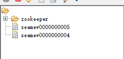
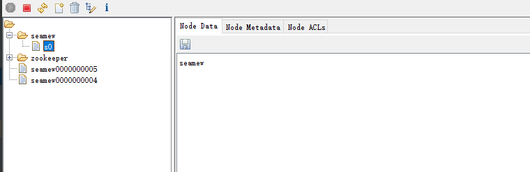
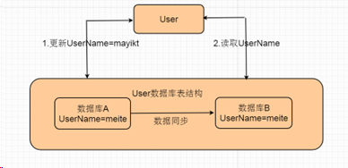
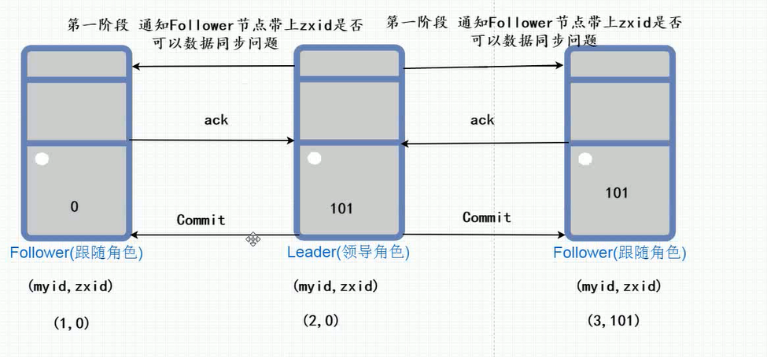

## 1、zookeeper的基本介绍

### 1.1、什么是Zookeeper

官方文档上这么解释zookeeper，它是一个分布式服务框架，是Apache Hadoop 的一个子项目，它主要是用来解决分布式应用中经常遇到的一些数据管理问题，如：统一命名服务、状态同步服务、集群管理、分布式应用配置项的管理等。

### 1.2、Zookeeper应用场景

1. 注册中心(Dubbo+Zookeeper)

2. 分布式配置中心(统一存放配置文件)

3. 分布式锁

4. 分布式队列

5. 分布式文件系统

### 1.3、linux安装zookeeper

```shell
# 1. 解压zk压缩包
tar -zxvf zookeeper-3.4.14.tar.gz

# 2. 进入到zk目录
cd zookeeper-3.4.14

# 3.在zk目录中创建data和logs文件夹
mkdir data
mkdir logs

# 4.进入到conf目录，修改文件名称
mv zoo_sample.cfg zoo.cfg
vi zoo.cfg
dataDir =/usr/local/zookeeper-3.4.14/data
dataLogDir=/usr/local/zookeeper-3.4.14/logs

# 5.启动zk
./zkServer.sh start
./zkServer.sh status
```

   ### 14.、zookeeper的基本特征

文件系统：定义的节点不允许重复

基本特征

* 定义的节点包含节点名称和节点内容
* 定义的节点名称不允许重复
* 每个节点可以设定值
* 根节点允许有多个
* 节点路径必须保证是唯一的，不允许重复
* 每个节点都会有事件通知，每当节点发生变化都会获取信息，例如删除修改

### 1.5、zookeeper节点的四种类型

1. 临时节点：会话关闭，自动消失
2. 临时顺序节点
3. 持久节点：会话关闭，持久化存储在硬盘
4. 持久顺序节点：会自动序列自增，保证唯一



> 注意：要先创建父节点才能创建子节点



### 1.6、ZooKeeper -状态信息 Stat 的属性说明

| 名称           | 含义                                                         |
| -------------- | ------------------------------------------------------------ |
| cZxid          | 数据节点创建时的事务ID                                       |
| ctime          | 数据节点创建时的时间                                         |
| mZxid          | 数据节点最后一次更新时的事务ID                               |
| mtime          | 数据节点最后一次更新时的时间                                 |
| pZxid          | 数据节点的子节点列表最后一次被修改（是子节点列表变更，而不是子节点内容变更）时的事务ID |
| cversion       | 子节点的版本号                                               |
| dataVersion    | 数据节点的版本号                                             |
| aclVersion     | 数据节点的ACL版本号                                          |
| ephemeralOwner | 如果节点是临时节点，则表示创建该节点的会话的SessionID；如果节点是持久节点，则该属性值为0 |
| dataLength     | 数据内容的长度                                               |
| numChildren    | 数据节点当前的子节点个数                                     |


## 2、ACL权限控制

ACL权限模型，实际上就是对树每个节点实现控制

身份的认证有4种方式：
* world：默认方式，相当于全世界都能访问
* auth：代表已经认证通过的用户(cli中可以通过addauth digest user:pwd 来添加当前上下文中的授权用户)
* digest：即用户名:密码这种方式认证，这也是业务系统中最常用的
* ip：使用Ip地址认证 

## 3、分布式锁的实现方式

1. 基于数据库实现分布式锁
2. 基于redis实现分布式锁
3. 基于zk实现分布式锁
4. 基于redission实现分布式锁

zk实现原理：临时节点 + 事件通知
1. 多请求同时创建相同的节点（lockPath），只要谁能够创建成功 谁就能够获取到锁；
2. 如果创建节点的时候，突然该节点已经被其他请求创建的话则直接等待；
3. 只要能够创建节点成功，则开始进入到正常业务逻辑操作，其他没有获取锁进行等待；
4. 正常业务逻辑流程执行完后，调用zk关闭连接方式释放锁，从而是其他的请求开始进入到获取锁的资源。

> 疑问：如果使用zk实现分布式锁，获取锁之后业务逻辑方法一直没有执行完毕，导致其他所有的请求等待的话如何解决？
>
> 设置Session连接超时时间，在规定的时间内获取锁后超时啦~自动回滚当前数据库业务逻辑。

## 4、一致性基本思想

> 注意：zk集群节点最好是奇数。
>
> 基本规则：剩余节点的总数大于集群节点总数/2，zk才可以正常运行



### 4.1、一致性基本思想

1. 强一致性

步骤1在修改数据库的userName为mayikt的时候，步骤2读取的userName内容；如果要一定读取到userName为mayikt而不是meite的话，那么数据库之间的通讯要非常迅速或者步骤2等待步骤1`(这里可以使用锁)`更新同步完成之后在查询，这种流程我们称为强一致性。

> **注意：在分布式领域不可能保证强一致性**

2. 弱一致性

允许数据库之间同步存在短暂的延迟，步骤2可以读取userName内容为meite而不是必须为mayikt；这种我们可以称作为弱一致性；

3. 最终一致性

允许步骤2读取userName为meite，中间允许数据库存在短暂延迟、但是最终读取数据结构必须为mayikt，所以这种访问我们称作为最终一致性；

### 4.2、zk如何保证一致性

原理：投票过半机制，2PC两阶段提交协议

预提交，接受回复，执行请求

如果已经满足了过半机制成为领导角色，后面的角色不需要进行选择步骤

### 4.3、Zookeeper集群使用Observer实现扩展

首先在Zookeeper中分为三种角色：

1. Leader(领导) Zookeeper集群中的主节点、负责写的请求操作，和各个节点同步；

2. Follower(跟随者) 是领导(Leader)角色根随着，出读取操作还可以实现对Leader提议与选举

3. Observer 如果后期当我们在扩展ZK集群节点时如果角色为Follower越来越多会导致选举的时间越来越长，所以Observer角色和Follower角色很相似，只是obServer不能够参与Leader角色选举；

**增加obServer的作用主要不影响原来本身选举的时间效率、目的是提高客户端读的请求效率；**

> ObServer相关配置
>
> 在zoo.conf 文件中新增
>
> server.4:192.168.212.212:2181:3181:observer

### 4.4、Zk集群节点总数为什么要是为奇数？

1. 加入Zookeeper的集群节点为5的话，宕机几个Zookeeper节点之后剩余的节点个数大于宕机个数；也就是必须大于剩下服务器个数n(集群节点总数)/2，Zookeeper才可以继续使用

2. 无论是奇数还是偶数个数可以做选举leader的，如果是5台集群节点也就是最多只可以允许两台zk宕机；如果是六台zk集群节点那么也是最多只能宕机2台，如果宕机3台的话zk无法可能。

3. 所以占用服务器空间利用成本角度考虑，建议zk集群节点一定是为奇数。

 ## 5、Zookeeper集群选举原理

### 5.1、Zookeeper读写机制

Zookeeper是有多个Server组成的集群，只有一个leader和多个follower

1. 每个follower节点保存父节点的副本；

2. 全局数据一定要保持一致；

3. 分布式读写模式，写的请求统一交个leader完成、follower节点主要实现读操作；

**注意：如果连接的节点不是leader，他会转发给leader进行写操作**

### 5.2、Zookeeper数据如何实现同步

1. 所有follower节点写的请求统一交个leader实现，并且创建一个全局zxid（事务id）

2. Leader节点在第一阶段通知阶段，会带上zxid向每位follower节点发出确认同步通知

3. 只要有过半数的follower节点确认同步ack，这时候leader就会向所有的follower发出commit事务数据提交；

这个和两阶段提交非常类似

> 为什么我们写的请求必须统一交给leader而不是follower节点实现？
>
> 因为可以采用借鉴在分布式事务中2pc（两阶段提交协议）解决分布式数据同步问题。



### 5.3、Zab原子广播两种协议

​		Zookeeper核心是原子广播协议(ZAB原子广播协议)，这种机制保证了各个节点的数据同步的问题，ZAB协议有有两种模式 分别为恢复模式(选主)和广播模式(同步)。

​		恢复模式：也就是当我们leader的节点宕机之后，会从新在剩余节点选出新的leader，新的leader选出之后采用广播模式实现各个节点与新的leader同步
​		广播模式：解决每个节点数据同步问题

### 5.4、zk数据同步原理

​		当我们zk中发出一个事务请求的时候，这时候我们Leader节点就会创建一个全局的zxid事务id。zxid会上锁保障数据的一致性，每次只能处理一个写操作。当我们写操作完成的时候，就会进行2PC同步。
​		第一阶段同步，带上zxid告诉每个Follower节点是否允许同步数据，Follower会返回给ACK。
​		第二阶段，如果收到半数ACK，leader节点就会发送commit（同步zxid和数据），发送数据完成数据同步。

> 为什么我们写的请求必须统一交给leader而不是follower节点实现？
>
> 因为可以采用借鉴在分布式事务中2pc（两阶段提交协议）解决分布式数据同步问题。

### 5.5、zxid有什么用？（选举实现原理）

发起投票的时候每个Server段都会产生（myid，zxid）选举，zxid（默认情况下为0）取决于每个节点最后一次做事务写的请求保存的ID
接受自己投票实现PK

1. 先检查zxid，谁最大，谁就是leader
2. 如果zxid都是一样大的情况下，myid最大的就是leader
3. leader的选择也与节点的启动顺序有关
4. 实现中Zxid是一个64位的数字，它高32位是epoch用来标识Leader关系是否改变，低32位来表示事务的顺序，用来保障事物的一致性。

> 为什么要先比较zxid呢？
>
> 因为zxid表示该节点有最新的数据。

### 5.6、网络分区(脑裂)

在集群的情况下，一般只会选举一个master节点、其他都是为从节点，那么如果发生了网络抖动或者部分节点相互无法通讯那么就会导致部分节点从新选举，这样就会存在多个master节点；

## 6、CAP理论

1. C：Consistency 在分布式系统中的所有数据备份，在同一时刻是否同样的值。等同于所有节点访问同一份最新的数据副本
2. A：Availability，在集群中一部分节点故障后，集群整体是否还能响应客户端的读写请求
3. P：Partition tolerance 在分布式系统中网络分区存在脑裂问题以后，部分server与集群其他节点失去联系 无法组成一个群体； 该问题一定是存在的~~~

目前我们当前技术环境下，不能同时满足CA，但是可以满足CP或者AP

>  为什么不能保证CA呢？
>
> 因为我们服务节点宕机，很难保证同一时刻同步问题。

## 7、Eureka与Zookeeper区别

### 相同点：

* Eureka和Zookeeper都可以实现微服务注册中心；

* 首先在这时候要明白一点：
  服务注册中心，可以短暂读取以前服务注册列表信息，但是不可以接受节点宕机不可用；

### 不同点：

* Zookeeper保证CP(一致性和分区容错) 当ZK在某种情况下出现宕机，会重新实现ZK选举新的领导者，如果zk选举的新的领导者时间过长，或者投票没有过半数，那么会导致整个zk集群节点不可用的，这也以为者服务注册中心不可用 ，所以Zk必须要保证数据一致性问题；

* Eureka保证AP,设计时优先考虑可用性，完全去中心化的设计思想，每个节点都均等；没有主从区分，几个节点挂掉了也不会影响正常的Eureka使用，Eureka客户端在连接时发现连接不可用会自动切换其他连接，只要Eureka有一个节点存在也就可以保证Eureka整个服务注册中心的使用；

* Zk保证数据一致性问题，Eureka保证可用性；
