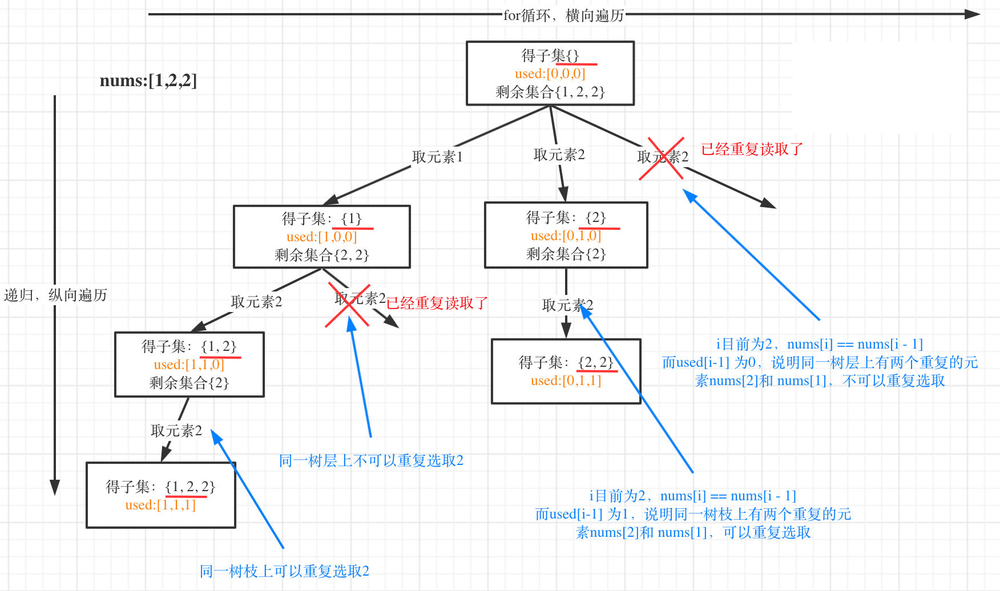
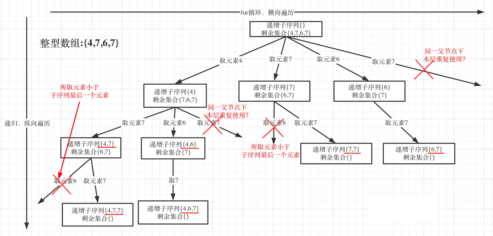

## 回溯算法used应该定义全局还是局部？

## 全局used

[题目链接](https://leetcode.cn/problems/subsets-ii/)

给定一个可能包含重复元素的整数数组 nums，返回该数组所有可能的子集（幂集）。

说明：解集不能包含重复的子集。

示例:
* 输入: [1,2,2]
* 输出: [ [2], [1], [1,2,2], [2,2], [1,2], [] ]

该算法是一个常见的回溯问题，需要遍历所有的子树，同时进行集合去重

用示例中的[1, 2, 2] 来举例，如图所示： **（注意去重需要先对集合排序）**



很容易得出c++代码如下：

```cpp
class Solution {
public:
    vector<vector<int>> res;
    vector<int> path;
    void backtracking(vector<int> nums, int startIndex, vector<bool> used) {
        if (startIndex > nums.size()) {
            return;
        }
        res.push_back(path);
        for (int i = startIndex; i < nums.size(); i++) {
            if (i > 0 && nums[i] == nums[i-1] && used[i-1] == false) {
                continue;
            }
            path.push_back(nums[i]);
            used[i] = true;
            backtracking(nums, i + 1, used);
            used[i] = false;
            path.pop_back();
        }

    }
    vector<vector<int>> subsetsWithDup(vector<int>& nums) {
        if (nums.size() == 0) {
            return res;
        } 
        // 这里的used数组定义为全局变量
        vector<bool> used(nums.size(), false);
        sort(nums.begin(), nums.end());
        backtracking(nums, 0, used);
        return res;
    }
};
```

## 局部used

[题目链接](https://leetcode.cn/problems/increasing-subsequences/)

给定一个整型数组, 你的任务是找到所有该数组的递增子序列，递增子序列的长度至少是2。

示例:

* 输入: [4, 6, 7, 7]
* 输出: [[4, 6], [4, 7], [4, 6, 7], [4, 6, 7, 7], [6, 7], [6, 7, 7], [7,7], [4,7,7]]

说明:

* 给定数组的长度不会超过15。
* 数组中的整数范围是 [-100,100]。
* 给定数组中可能包含重复数字，相等的数字应该被视为递增的一种情况

和上题一样进行画图理解：



很容易得出c++代码如下：

```cpp
class Solution {
public:
    vector<vector<int>> res;
    vector<int> path;
    void backtracking(vector<int> nums, int startIndex) {
        if (path.size() > 1) {
            res.push_back(path);
        }
        // 这里定义为局部变量
        int hash[201] = {0};
        for(int i = startIndex; i < nums.size(); i++) {
            if ((path.size() > 0 && nums[i] < path.back()) || hash[nums[i] + 100] == 1) {
                continue; 
            }
            hash[nums[i] + 100] = 1;
            path.push_back(nums[i]);    
            backtracking(nums, i + 1);
            path.pop_back();
        }

    }
    vector<vector<int>> findSubsequences(vector<int>& nums) {
        if (nums.size() == 0) {
            return res;
        }
        backtracking(nums, 0);
        return res;
    }
};
```

## 如何选择？

:::tip 通过上面的两种图可以注意到！
* 全局变量是对整个树的比较
* 局部变量是对树枝的比较
* 当回溯算法不需要关系其他分支的情况的时候选择局部used数组
* 通常情况下，需要考虑其他树枝的情况选择全局used数组
:::