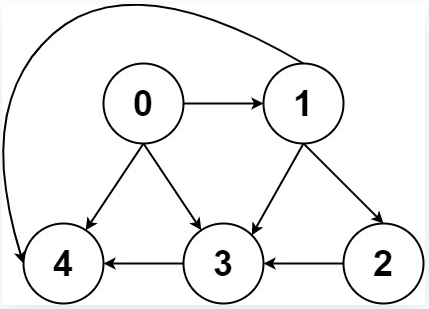
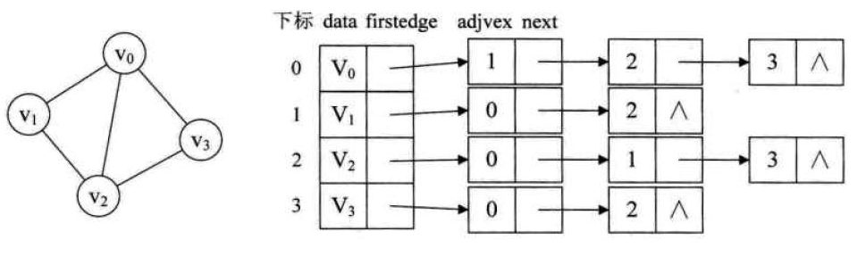
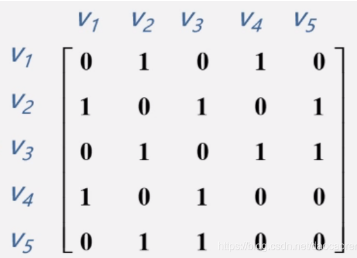

## 1、什么是图？

一幅图是由**节点**和**边**构成的，逻辑结构如下：



图一般有两种存储结构分为：

1. 邻接表



2. 邻接矩阵



```cpp
// 邻接表
// graph[x] 存储 x 的所有邻居节点
vector<vector<int>> graph

// 邻接矩阵
// matrix[x][y] 记录 x 是否有一条指向 y 的边
vector<vector<int>> matrix
```

## 2、dfs算法模板

```cpp
void dfs(参数) {
    处理节点;
    if (终止条件) {
        存放结果;
        撤销处理结果；--（可选）
        return;
        // 这里也可以选择不return，那就没有必要撤销了
    }
    for (选择：本节点所连接的其他节点) {
        dfs(图，选择的节点); // 递归
    }
    回溯，撤销处理结果
}
```

## 3、dfs和回溯算法的区别

这里先给出回溯算法的模板

```cpp
void backtracking(参数) {
    if (终止条件) {
        存放结果;
        return;
    }
    for (选择：本层集合中元素（树中节点的数量就是集合的大小）) {
        处理节点;
        backtracking(路径，选择列表); // 递归
        回溯，撤销处理结果
    }
}
```

相同点：

* dfs也是回溯算法的一种，都是递归思想的具体体现

不同点：

* 回溯算法的「做选择」和「撤销选择」在 for 循环里面，而dfs算法在for循环外面
* 回溯算法关注的不是节点，而是树枝。
* dfs算法关注节点。是因为一个图可以有独立的节点，他们之间没有边进行连接。