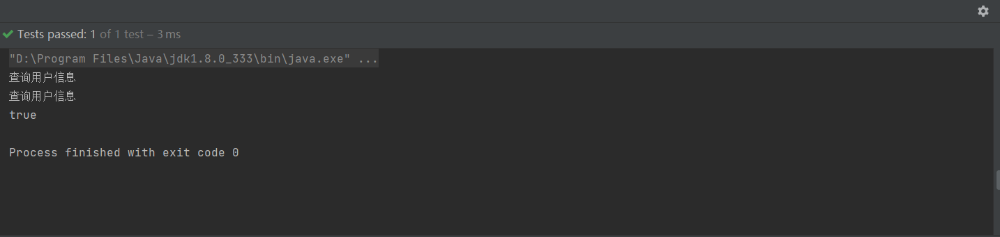
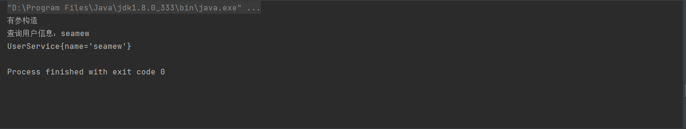
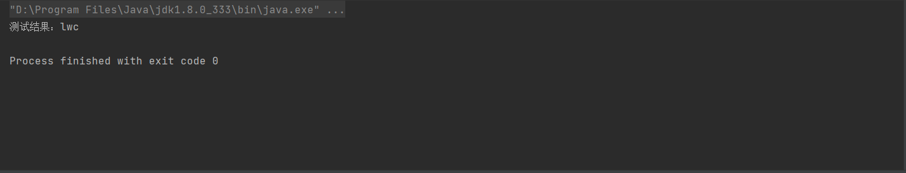
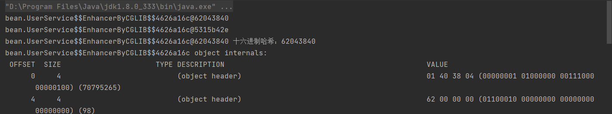
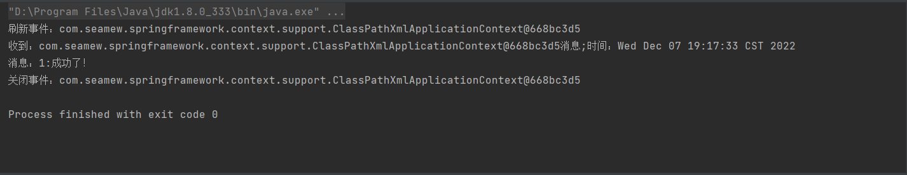
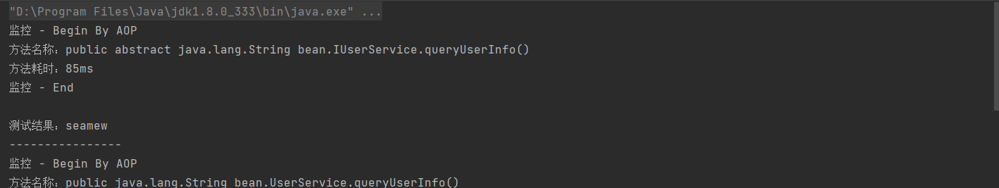
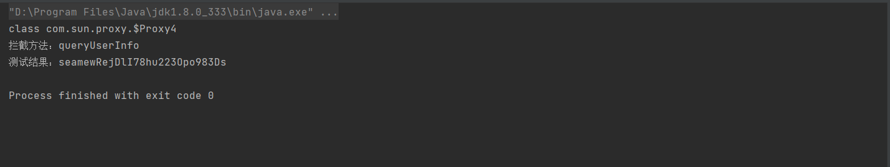
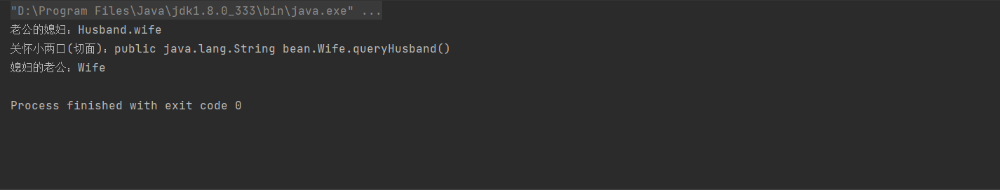

::: tip my-spring
一个精简版本的spring框架。实现了spring的核心功能。（这里的spring版本是5.2.2.RELEASE）

[本项目GitHub地址](https://github.com/Sun1040084806/my-spring)
:::

## IOC

### BeanFactory

```java
@Test
public void test_BeanFactory(){
    // 1.初始化 BeanFactory
    DefaultListableBeanFactory beanFactory = new DefaultListableBeanFactory();
    // 2.注册 bean
    BeanDefinition beanDefinition = new BeanDefinition(UserService.class);
    beanFactory.registerBeanDefinition("userService", beanDefinition);
    // 3.第一次获取 bean
    UserService userService = (UserService) beanFactory.getBean("userService");
    userService.queryUserInfo();
    // 4.第二次获取 bean from Singleton
    UserService userService_singleton = (UserService) beanFactory.getBean("userService");
    userService_singleton.queryUserInfo();
    System.out.println(userService_singleton == userService);
}
```



### BeanDefinition

```java
@Test
public void test_BeanFactory() {
    // 1.初始化 BeanFactory
    DefaultListableBeanFactory beanFactory = new DefaultListableBeanFactory();

    // 2. 注入bean
    BeanDefinition beanDefinition = new BeanDefinition(UserService.class);
    beanFactory.registerBeanDefinition("userService", beanDefinition);

    // 3.获取bean
    UserService userService = (UserService) beanFactory.getBean("userService", "seamew");
    userService.queryUserInfo();
    System.out.println(userService);
}
```



### XmlBeanDefinitionReader

```java
@Test
public void test_xml() {
    // 1.初始化 BeanFactory
    DefaultListableBeanFactory beanFactory = new DefaultListableBeanFactory();

    // 2. 读取配置文件&注册Bean
    XmlBeanDefinitionReader reader = new XmlBeanDefinitionReader(beanFactory);
    reader.loadBeanDefinitions("classpath:spring.xml");

    // 3. 获取Bean对象调用方法
    UserService userService = beanFactory.getBean("userService", UserService.class);
    String result = userService.queryUserInfo();
    System.out.println("测试结果：" + result);
}
```



### BeanPostProcessor

```java
@Test
public void test_BeanFactoryPostProcessorAndBeanPostProcessor() {
    // 1.初始化 BeanFactory
    DefaultListableBeanFactory beanFactory = new DefaultListableBeanFactory();
    // 2.读取配置文件 & 注册 Bean
    XmlBeanDefinitionReader reader = new XmlBeanDefinitionReader(beanFactory);
    reader.loadBeanDefinitions("classpath:spring.xml");
    // 3.BeanDefinition 加载完成 & Bean 实例化之前，修改 BeanDefinition 的属性值
    MyBeanFactoryPostProcessor beanFactoryPostProcessor = new MyBeanFactoryPostProcessor();
    beanFactoryPostProcessor.postProcessBeanFactory(beanFactory);
    // 4.Bean 实例化之后，修改 Bean 属性信息
    MyBeanPostProcessor beanPostProcessor = new MyBeanPostProcessor();
    beanFactory.addBeanPostProcessor(beanPostProcessor);
    // 5.获取 Bean 对象调用方法
    UserService userService = beanFactory.getBean("userService", UserService.class);
    System.out.println("测试结果: " + userService.queryUserInfo());
}
```


### ApplicationContext

```java
@Test
public void test_xml() {
    // 1.初始化 BeanFactory
    ClassPathXmlApplicationContext applicationContext = new ClassPathXmlApplicationContext("classpath:spring.xml");
    // 2.获取 Bean 对象调用方法
    UserService userService = applicationContext.getBean("userService", UserService.class);
    System.out.println(userService.queryUserInfo());
    applicationContext.close();
}
```


### 多例和单例

```java
@Test
public void test_prototype() {
    // 1.初始化 BeanFactory
    ClassPathXmlApplicationContext applicationContext = new ClassPathXmlApplicationContext("classpath:spring.xml");
    applicationContext.registerShutdownHook();

    // 2. 获取Bean对象调用方法
    UserService userService01 = applicationContext.getBean("userService", UserService.class);
    UserService userService02 = applicationContext.getBean("userService", UserService.class);

    // 3. 配置 scope="prototype/singleton"
    System.out.println(userService01);
    System.out.println(userService02);

    // 4. 打印十六进制哈希
    System.out.println(userService01 + " 十六进制哈希：" + Integer.toHexString(userService01.hashCode()));
    System.out.println(ClassLayout.parseInstance(userService01).toPrintable());
}
```



### EventListener

```java
@Test
public void test_event() {
    ClassPathXmlApplicationContext applicationContext = new ClassPathXmlApplicationContext("classpath:spring.xml");
    applicationContext.registerShutdownHook();
    applicationContext.publishEvent(new CustomEvent(applicationContext, 1L, "成功了！"));
}
```



## AOP

### AdvisedSupport

```java
@Test
public void test_dynamic() {
    // 目标对象
    IUserService userService = new UserService();

    // 组装代理信息
    AdvisedSupport advisedSupport = new AdvisedSupport();
    advisedSupport.setTargetSource(new TargetSource(userService));
    advisedSupport.setMethodInterceptor(new UserServiceInterceptor());
    advisedSupport.setMethodMatcher(new AspectJExpressionPointcut("execution(* bean.IUserService.*(..))"));

    // 代理对象(JdkDynamicAopProxy)
    IUserService proxy_jdk = (IUserService) new JdkDynamicAopProxy(advisedSupport).getProxy();
    // 测试调用
    System.out.println("测试结果：" + proxy_jdk.queryUserInfo());

    System.out.println("----------------");

    // 代理对象(Cglib2AopProxy)
    IUserService proxy_cglib = (IUserService) new Cglib2AopProxy(advisedSupport).getProxy();
    // 测试调用
    System.out.println("测试结果：" + proxy_cglib.queryUserInfo());
}
```



### AOP融入生命周期

```java
@Test
public void test_circular() {
    ClassPathXmlApplicationContext applicationContext = new ClassPathXmlApplicationContext("classpath:spring.xml");
    Husband husband = applicationContext.getBean("husband", Husband.class);
    Wife wife = applicationContext.getBean("wife", Wife.class);
    System.out.println("老公的媳妇：" + husband.queryWife());
    System.out.println("媳妇的老公：" + wife.queryHusband());
}
```




## 循环依赖

```java
@Test
public void test_circular() {
    ClassPathXmlApplicationContext applicationContext = new ClassPathXmlApplicationContext("classpath:spring.xml");
    Husband husband = applicationContext.getBean("husband", Husband.class);
    Wife wife = applicationContext.getBean("wife", Wife.class);
    System.out.println("老公的媳妇：" + husband.queryWife());
    System.out.println("媳妇的老公：" + wife.queryHusband());
}
```

